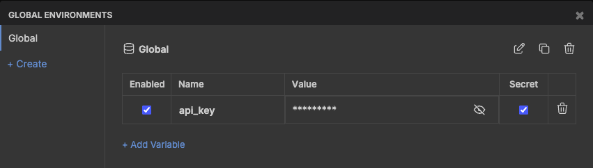

# Collections

Pre-configured collections to interact with 20+ blockchains & Alchemy endpoints.

You'll find 200+ ready-to-use requests across various blockchains (Ethereum, Solana, Bitcoin) and protocols.

We use [Bruno](https://www.usebruno.com/) - an open-source, git-based and fully offline API client.

## Support

| Collection   | JSON-RPC | WebSocket | gRPC | REST API | GraphQL |
|--------------|----------|-----------|------|----------|---------|
| **alchemy**  | ✓        | N/A       | N/A  | ✓        | N/A     |
| **evm**      | ✓        | ✓         | N/A  | N/A      | N/A     |
| **aptos**    | N/A      | N/A       | ✓    | ✓        | ✓     |
| **bitcoin**  | ✓        | N/A       | N/A  | N/A      | N/A     |
| **solana**   | ✓        | ✓         | ✓    | N/A      | N/A     |
| **sui**      | ✓        | N/A       | ✓    | N/A      | ✓       |
| **zksync**   | ✓        | N/A       | N/A  | N/A      | N/A     |

## Getting Started

### Installation

Go to [usebruno.com/downloads](https://www.usebruno.com/downloads) or use Homebrew:

```bash
brew install bruno
```

### Usage 

1. **Clone the repository:**
```bash
git clone https://github.com/alchemyplatform/collections.git
```

2. **Open a collection in Bruno:**
  - Launch Bruno.
  - Click **Open Collection**.
  - Select a collection (e.g. `evm/`, `solana/`, `alchemy/`).

3. **Add your API key:**
  - Open the collection in Bruno.
  - Go to **Environments** tab.
  - Create a Global environment to use across multiple collections.
    
  - Add your Alchemy API key:
    ```
    api_key: your-alchemy-api-key-here
    ```

4. **Start testing:**
  - Browse available requests.
  - Click **Send** to execute.
  - View responses and documentation

## Updates

To get latest collections, navigate to your local `collections` directory and run:

```bash
git pull
```

## Contributing 🙋

We welcome contributions!
This repo is maintained by [Alchemy's Solutions Engineering team](https://github.com/alchemyplatform/lab).

### How to Contribute

To add new blockchain methods or improve existing collections:

1. **Fork the repository**

2. **Add your `.bru` file:**
  - Place it in the appropriate collection folder (e.g., `evm/eth/`, `solana/`, `alchemy/`).
  - Follow the existing format with example parameters and documentation.
  - Include inline docs describing the method, parameters, and use cases.

3. **Create a Pull Request:**
  - Provide a clear description of what you're adding or fixing.
  - Include example usage if adding a new method.
  - Reference any related issues.

### Examples

- **New methods** - add missing RPC methods or API endpoints
- **Better examples** - improve parameter values with real-world use cases  
- **Documentation** - enhance inline documentation in `.bru` files
- **Bug fixes** - fix incorrect parameters or broken requests

